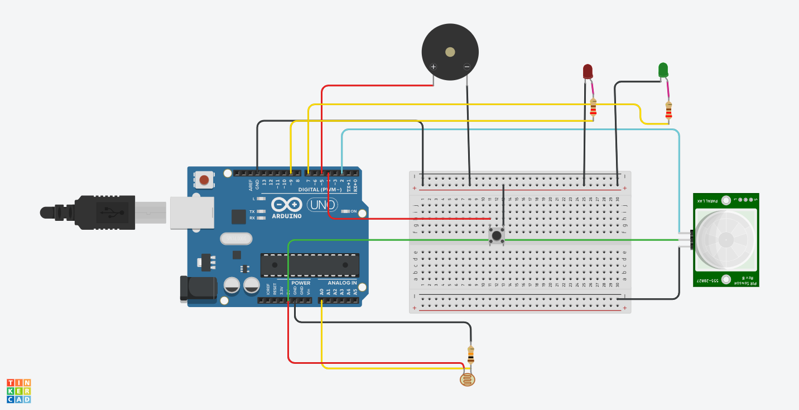

 💡 Smart Room Light with Smooth LED Fade

An intelligent Arduino-based lighting system that reacts to **light levels**, **motion**, and **manual input**. Built using LDR, PIR sensor, `millis()`-based LED fading, and manual override logic — just like a smart home automation system!

---

## 🌟 Key Features

- 🌞 **Auto Light Control** — Uses LDR + PIR for ambient light & motion detection  
- 🌈 **Smooth LED Fade** — `analogWrite()` with `millis()` (non-blocking)  
- 🔘 **Manual Override** — Push button to toggle light manually  
- 💤 **Idle Mode** — Dim status LED when inactive  
- 🚨 **Intrusion Alert** — Buzzer triggers if light drops suddenly + motion detected  
- ⏲️ **Auto Shutoff** — Turns off after 2 minutes of no motion

---

## 🖼️ Circuit Overview



```text
LDR         --> A0 + 5V (with 10k to GND)
PIR Sensor  --> D2
Main LED    --> D9 (with 220Ω)
Status LED  --> D7 (with 220Ω)
Push Button --> D4 (uses INPUT_PULLUP)
Buzzer      --> D5
🔩 Components Used
Component	Pin
LDR	A0
PIR Sensor	D2
Main LED	D9
Status LED	D7
Push Button	D4
Buzzer	D5
Resistors	10k (LDR), 220Ω (LEDs)

✅ Simulated in Tinkercad for testing

📁 Files Included
File	Description
Led_Fade_LDR.ino	Main Arduino sketch
Smart_room_light.png	Circuit diagram image
README.md	This documentation file

📽️ Demo Idea (Optional)
Simulate day/night using LDR
Walk into the room → LED fades ON
Leave → After 2 minutes, auto fade OFF
Press button anytime to override light

🚀 Real-World Use Cases
Smart room lighting in homes or hotels

Motion + light-based energy-saving systems

School, lab, or internship project

Portfolio project to show embedded logic skills

👨‍💻 Author
Parth Pawar
🔗 GitHub
🔗 LinkedIn

💡 Dream: To build intelligent systems that understand, help, and care for people.

🔖 Tags
arduino, ldr, pir, led fade, smart light, home automation, iot, embedded, tinkercad
